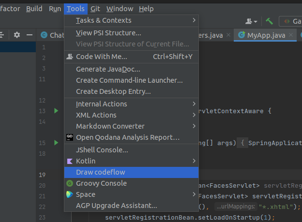
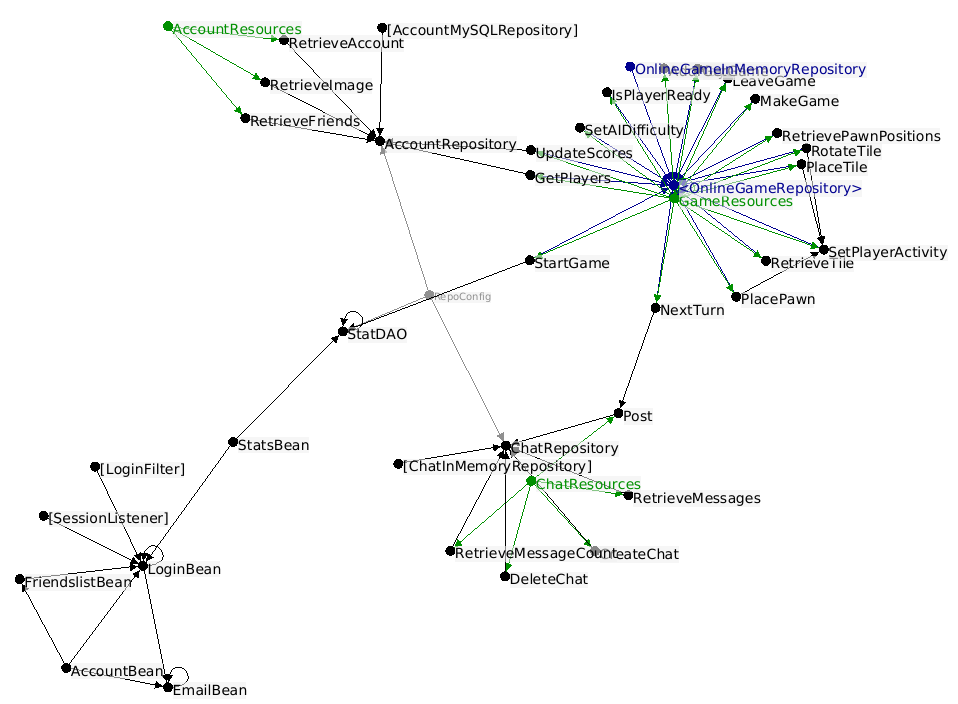

# Codeflow
The intention of this project is to create a simple and easy to use tool 
for creating flowcharts from code. The tool should display where data from starting 
one place will end up on the other side of the program without having to navigate 
through all the dependencies.

# Current state
- [x] Retrieve all (in)direct `@Component` annotated classes
- [x] Find usages of `@Component` annotated classes
- [x] Retrieve all `@Bean`s
- [x] Find usages of `@Bean`s
- [x] Retrieve autowired interfaces
- [ ] Disable `@Configuration` references by default

